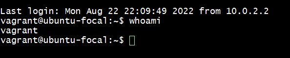

Task: Research online for 10 more linux commands aside the ones already mentioned in this module. Submit using your altschool-cloud-exercises project, 
explaining what each command is used for with examples of how to use each and example screenshots of using each of them.
  
this command shows the calender for the year 2022

  
this is to search out a specific file or directory

  
this is to bring out all the commands you run previously

  
display the amount of free and used memory in the system

  
this print the name associated to the user ID

  
list all files in the directory

  
display linux system information

  
to give the current user admin previllage

  
display the last users who have logged onto the system

  
to browse through a text file
