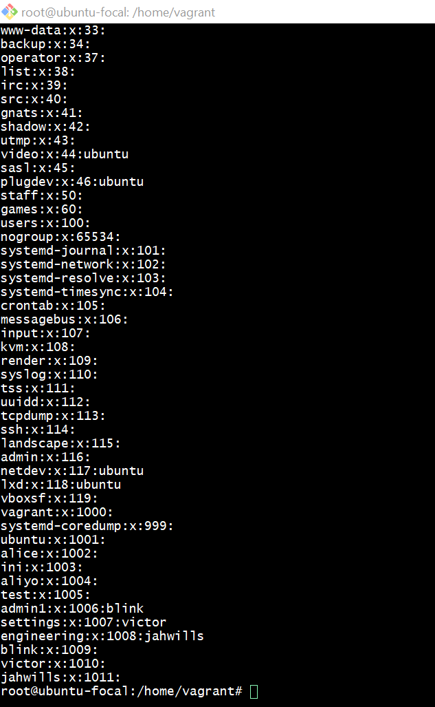
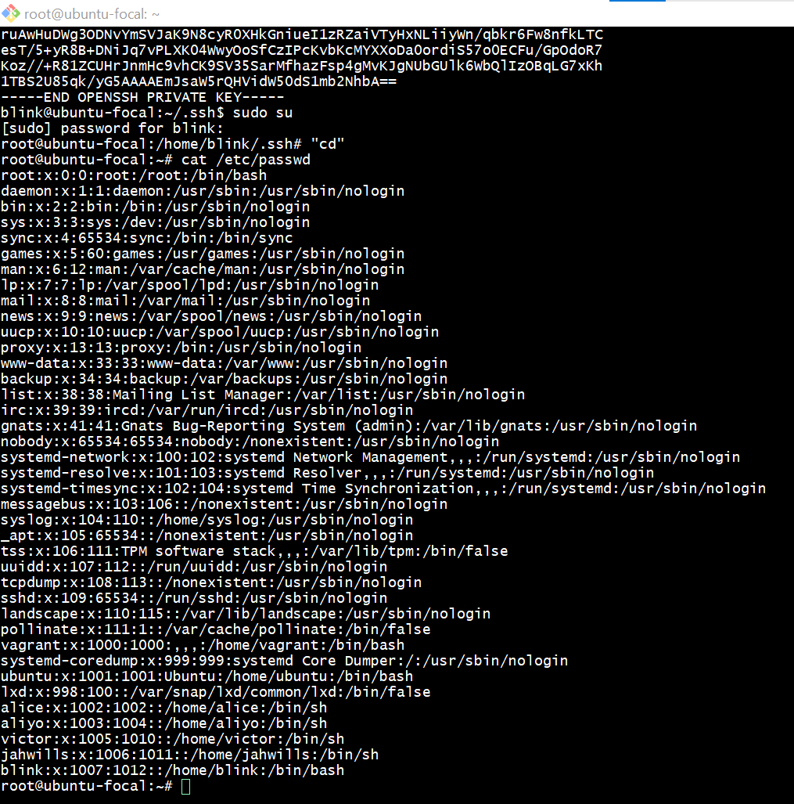
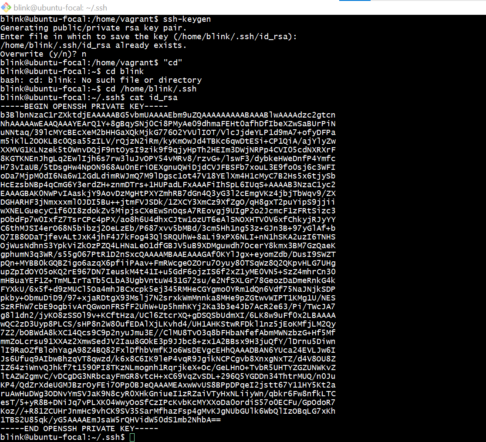
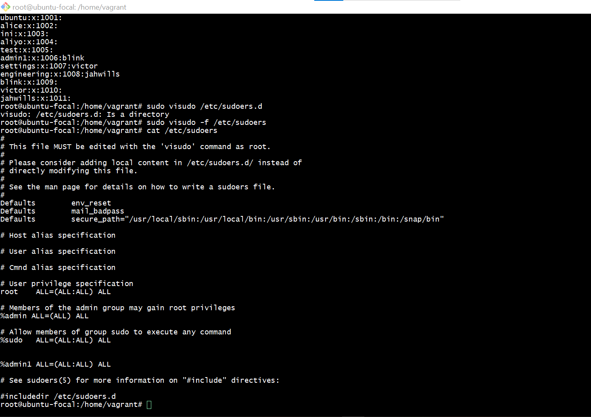

this is to bring out the group command

 
this is to bring passwd commands 

 
this is to bring the ssh keys commands 

 
this is to bring out the ssh commands 

 
this is to bring out sudoers the commands 
