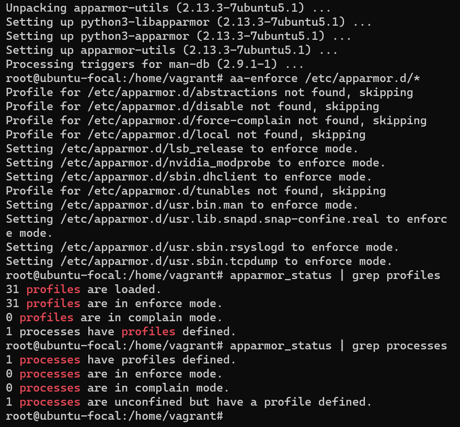
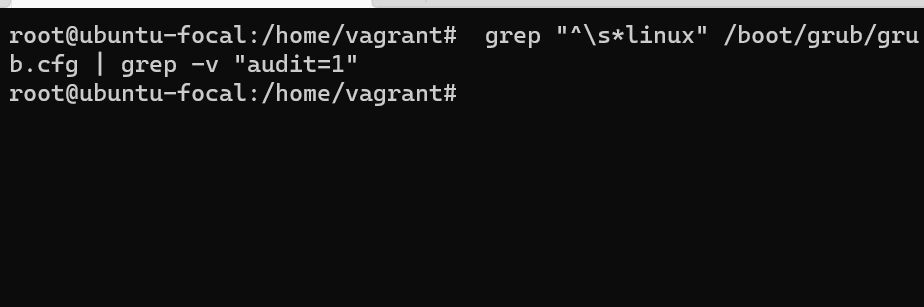
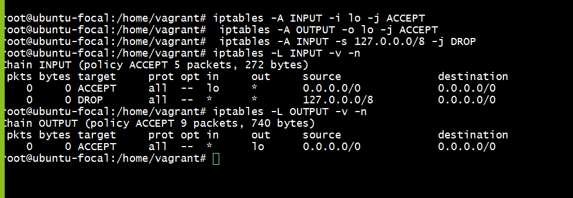
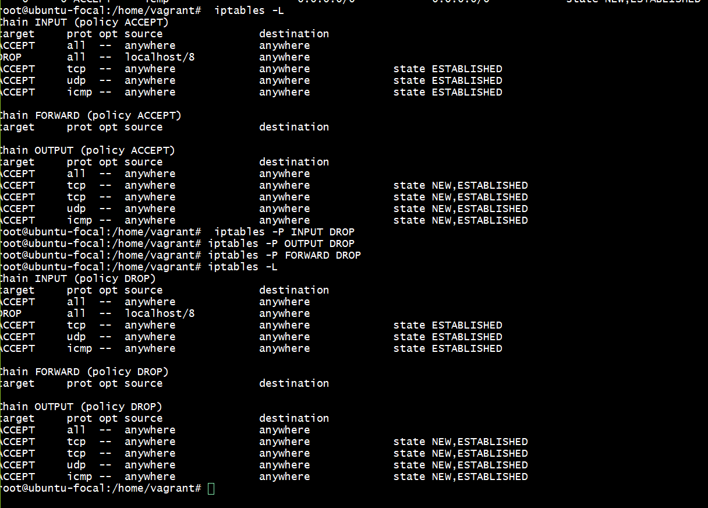
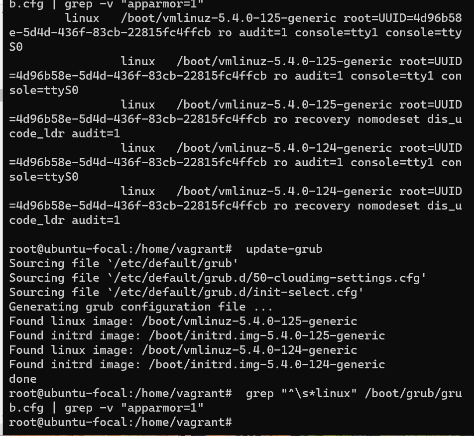

# list of configuration l did on my ubuntu
# 1. Ensure all AppArmor Profiles are enforcing (Automated)
this is the results of the configuration.

# 2. Ensure auditing for processes that start prior to auditd is 
enabled (Automated)
this is the result of the configuration.

# 3.  Ensure iptables outbound and established connections are 
configured (Manual)
this is the result of the configuration.

# 4.  Ensure iptables loopback traffic is configured (Automated)
this is the result of the configuration.

# 5.  Ensure minimum days between password changes is configured 
(Automated)
this is the result of the configuration.
 

# 6. Ensure iptables outbound and established connections are 
configured (Manual)
this is the result of the configuration.

# 7. Ensure password expiration is 365 days or less (Automated)
this the the result of the configuration.

# 8. Ensure iptables default deny firewall policy (Automated)
this is the result of the configuration.

# 9. Ensure local login warning banner is configured properly
this is the result of the configuration.

# 10.  Ensure AppArmor is enabled in the bootloader configuration
this is the result of the configuration.
