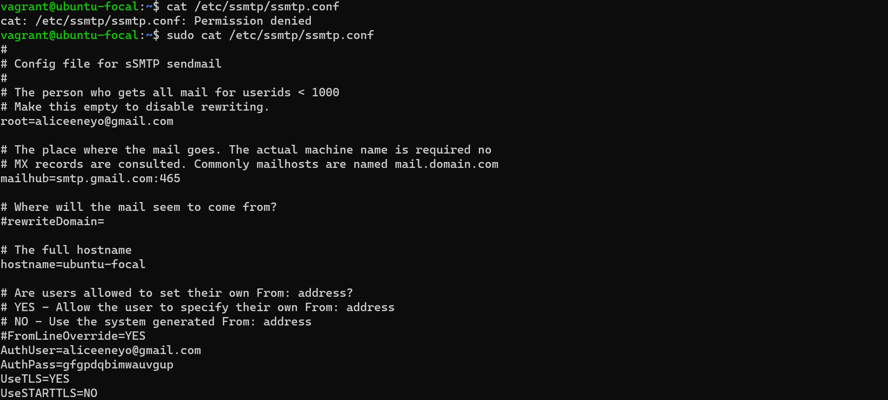
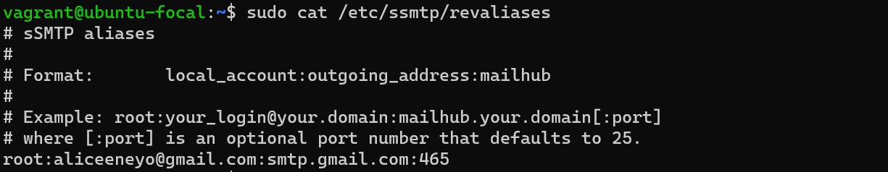
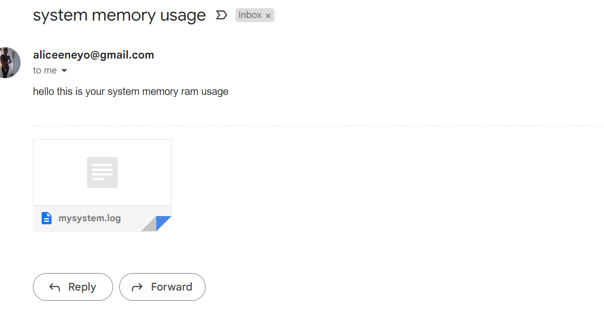

# content of my script, cronjob and sample of email sent.
# 1. cronjob
this is the results of the cronjob configuration.

# 2. cronjob2
this is the result of the cronjob2 configuration.

# 3.  email
this is the result of the  email configuration.

# 4.  bash scripting
this is the result of the bash script configuration.

